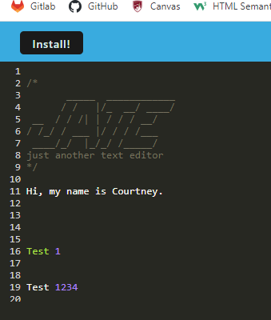

# Title

Progressive Web Application Project

## Description

AS A developer
I WANT to create notes or code snippets with or without an internet connection
SO THAT I can reliably retrieve them for later use

## Demo/Screenshots

  <table>
  <tr>
    <td>Progressive Web Application Demo/Screenshots</td>
  </tr>
  <tr>
    <td></td>
  </tr>
  </table>

  <table>
  <tr>
    <td>NoSQL Project Video</td>
  </tr>
  <tr>
    <td></td>
  </tr>
  </table>

## Project URL

https://github.com/csherman177/pWebApp

## GitHub Deployment

https://csherman177.github.io/pWebApp/

## Heroku Deployment

## Contact

Email: csherman177@gmail.com

## Author

Author(s): Courtney Sherman
GitHub: https://github.com/csherman177/
